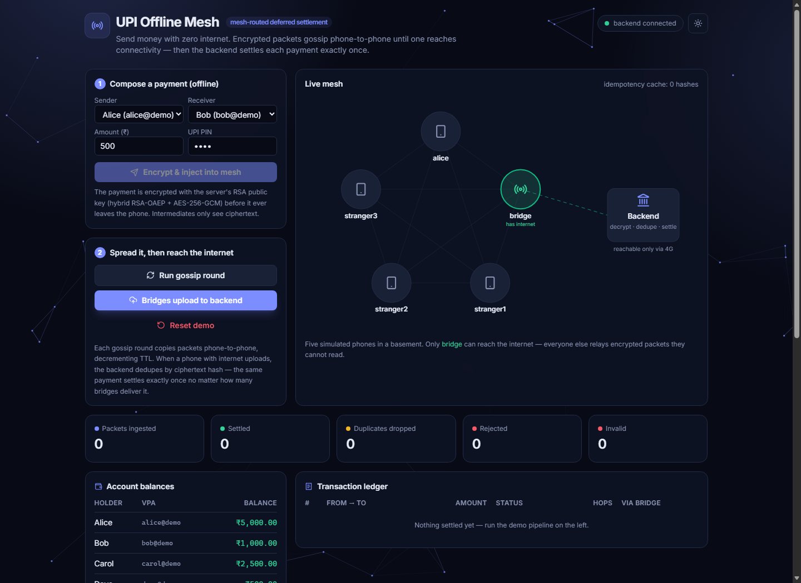

# UPI Offline Mesh

**Send money with zero internet.** A payment is encrypted on your phone, gossips device-to-device across a Bluetooth-style mesh, and settles on the backend the moment *any* phone in the chain reaches connectivity — decrypted, deduplicated, and posted to the ledger exactly once.

[](https://github.com/RajvardhanJhala/UPI_Without_Internet_2.0/actions/workflows/ci.yml)
&nbsp;·&nbsp; **[▶ Live demo](https://upi-without-internet-2-0.vercel.app)** &nbsp;·&nbsp; Java 17 · Spring Boot 3.3 · React 19 · TypeScript

> **[https://upi-without-internet-2-0.vercel.app](https://upi-without-internet-2-0.vercel.app)** — the backend is on a free tier that sleeps after ~15 min idle, so the first load may take 30–50s to wake it (the status badge shows "backend unreachable" until it does). Everything after that is instant.



---

## What it demonstrates

Three things, working end to end and visible in the live demo:

1. **A payment travels through untrusted strangers' phones without any of them being able to read or tamper with it** — hybrid RSA-OAEP + AES-256-GCM encryption.
2. **Even when the same payment reaches the backend simultaneously through multiple relays, it settles exactly once** — idempotency via an atomic compare-and-set on the ciphertext hash.
3. **A tampered, stale, or replayed packet is rejected** before it ever touches the ledger.

The mesh is software-simulated so the whole flow runs on one machine with no Bluetooth hardware.

---

## Architecture

The app is split into a **React frontend** (deployed on Vercel) and a **Spring Boot API** (deployed on Render). The browser talks only to the API; the API is the piece that owns the crypto, the idempotency gate, and the ledger.

```
┌──────────────────────────────┐        ┌─────────────────────────────────────────┐
│  React + Vite frontend        │  HTTPS │  Spring Boot API                          │
│  (Vercel)                     │ ─────▶ │  (Render)                                 │
│                               │  + SSE │                                           │
│  • live mesh visualization    │ ◀───── │  /api/bridge/ingest  ← the real endpoint  │
│  • drives the demo pipeline   │        │    1. SHA-256(ciphertext)                 │
│  • animated on server events  │        │    2. idempotency claim (atomic)          │
└──────────────────────────────┘        │    3. RSA-OAEP + AES-GCM decrypt          │
                                         │    4. freshness / replay check            │
                                         │    5. @Transactional debit + credit       │
                                         └─────────────────────────────────────────┘
```

The **mesh itself** — five simulated phones, four offline and one "bridge" with internet — lives inside the backend so the whole system is demoable end to end:

```
  SENDER PHONE (offline)
  PaymentInstruction { sender, receiver, amount, pinHash, nonce, signedAt }
        │ encrypt with server's RSA public key
        ▼
  MeshPacket { packetId, ttl, createdAt, ciphertext }
        │ Bluetooth gossip, hop by hop, TTL decrements
        ▼
  stranger1 ──▶ stranger2 ──▶ bridge  ◀── walks outside, gets 4G
                                 │ HTTPS POST
                                 ▼
                          Spring Boot API (settles exactly once)
```

---

## The three hard problems

### 1 · Untrusted couriers

A random stranger's phone is carrying your transaction. How do you stop them reading the amount or changing it?

**Hybrid encryption (RSA-OAEP + AES-256-GCM).** A fresh AES-256 key encrypts the JSON payload with GCM (fast + *authenticated*); RSA-OAEP encrypts just that AES key with the server's public key. Intermediates see only opaque ciphertext. Because GCM is authenticated, flipping a single bit anywhere makes decryption throw — the server can't be tricked into processing tampered data. This is the same scheme TLS uses. See [`HybridCryptoService.java`](src/main/java/com/demo/upimesh/crypto/HybridCryptoService.java).

### 2 · The duplicate storm

Multiple relays hold the same packet and all upload within milliseconds. Process all of them and the sender is debited three times.

**Atomic compare-and-set on `SHA-256(ciphertext)`.** The first thing the server does is try to *claim* the hash:

```java
Instant prev = seen.putIfAbsent(packetHash, now);
return prev == null;   // true = first claimer, false = duplicate
```

`ConcurrentHashMap.putIfAbsent` is atomic — even under 100 concurrent threads, exactly one returns `null` and proceeds to settle; the rest are short-circuited as `DUPLICATE_DROPPED`. Hashing the *ciphertext* (not the packetId, which a relay could rewrite) means two legitimate deliveries of the same payment are byte-identical and dedupe correctly, while a genuinely new payment carries a fresh nonce and settles. A unique DB index on `transactions.packet_hash` is the defense-in-depth fallback. See [`IdempotencyService.java`](src/main/java/com/demo/upimesh/service/IdempotencyService.java) and [`BridgeIngestionService.java`](src/main/java/com/demo/upimesh/service/BridgeIngestionService.java).

In production the `ConcurrentHashMap` becomes Redis `SET key NX EX 86400` — identical semantics, distributed across replicas.

### 3 · Replay attacks

An attacker who captured a ciphertext could replay it later.

**Two layers, both inside the encrypted payload:** a `signedAt` timestamp (packets older than 24h are rejected) and a UUID `nonce`. Neither can be altered without breaking the GCM tag, and a byte-identical replay is caught by the idempotency cache.

---

## Tech stack

| | |
|---|---|
| **Backend** | Java 17, Spring Boot 3.3 (Web, Data JPA, Validation), H2 in-memory, Server-Sent Events |
| **Frontend** | React 19, TypeScript, Vite, Tailwind CSS v4, lucide icons, canvas-animated mesh background |
| **Crypto** | RSA-2048 / OAEP-SHA256 + AES-256-GCM (JDK `javax.crypto`) |
| **Deploy** | Frontend → Vercel · Backend → Render (Docker) · CI → GitHub Actions |

---

## Run it locally

You need **JDK 17+** and **Node 18+**.

**1. Backend** (port 8080):

```bash
./mvnw spring-boot:run        # Windows: mvnw.cmd spring-boot:run
```

**2. Frontend** (port 5173) — in a second terminal:

```bash
cd web
npm install
npm run dev
```

Open **http://localhost:5173**. The Vite dev server proxies `/api` to the backend, so no configuration is needed. Drive the demo: compose a payment → run gossip → bridges upload → watch it settle, with the mesh animating live off the SSE stream.

Run the backend tests (the headline one fires three threads at the same packet and asserts exactly one settles):

```bash
./mvnw test
```

---

## Deployment

Both halves deploy from this repo with the config already checked in.

**Backend → Render.** New → Blueprint → this repo. Render reads [`render.yaml`](render.yaml) and builds the [`Dockerfile`](Dockerfile). After the frontend is up, set the `CORS_ALLOWED_ORIGINS` env var to your Vercel origin (`https://*.vercel.app` also covers preview deploys).

**Frontend → Vercel.** Import the repo, set **Root Directory** to `web`, and add env var `VITE_API_BASE_URL` = your Render URL (Vite bakes it in at build time, so set it before the first deploy). SPA config is in [`web/vercel.json`](web/vercel.json).

---

## API reference

| Method | Path | Purpose |
|---|---|---|
| GET | `/` | JSON API index |
| GET | `/api/server-key` | Server's RSA public key |
| GET | `/api/accounts` | Accounts and balances |
| GET | `/api/transactions` | Recent settled transactions |
| GET | `/api/stats` | Outcome breakdown (settled / dropped / rejected / invalid) |
| GET | `/api/mesh/state` | State of every simulated device |
| GET | `/api/mesh/events` | **SSE stream** of injection / gossip / settlement events |
| POST | `/api/demo/send` | Simulate a sender phone — encrypt + inject a packet |
| POST | `/api/mesh/gossip` | Run one round of mesh gossip |
| POST | `/api/mesh/flush` | Bridges with internet upload to the backend (in parallel) |
| POST | `/api/mesh/reset` | Clear the mesh + idempotency cache |
| POST | `/api/bridge/ingest` | **The production endpoint** a real bridge node would POST to |

---

## Honest scope

This is deliberately named **mesh-routed deferred settlement**, not "real-time offline UPI." Being straight about what the design does *not* solve — these are inherent to "no internet, anywhere in the chain," not implementation bugs:

- **The receiver holds an IOU, not settled funds.** If the sender's account is empty when the packet finally arrives, settlement is rejected and the receiver has no recourse. Real offline UPI (UPI Lite) solves this with a pre-funded, hardware-backed wallet.
- **A malicious sender can double-spend offline** — send to Bob in one basement, Carol in another; whichever packet reaches the backend first wins. Same root cause.
- **Real Bluetooth is hard** — background BLE is heavily throttled on modern phones; this demo simulates the mesh to focus on the settlement problem.

The cryptography and exactly-once settlement, though, are real, production-shaped engineering — that's the point of the project. In a real deployment the private key moves to an HSM/KMS, the idempotency map becomes Redis, H2 becomes Postgres, and `/api/bridge/ingest` gets mutual TLS and per-node rate limits; the crypto and idempotency code stay essentially as-is.
